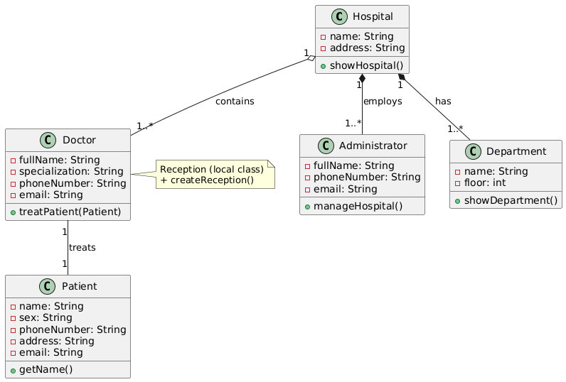
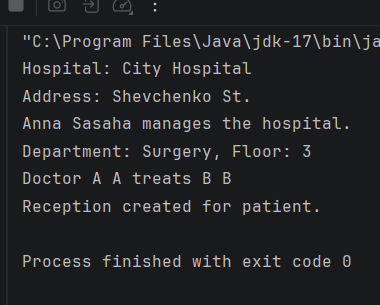

#Лабораторна робота №4
##Розробка структури класів з урахуванням зазначеної предметної області.

##UML-діаграма

> - Inner class: `Administrator`  
> - Static nested class: `Department`  
> - Local class: `Reception`  
> - Композиція: Hospital → Department, Hospital → Administrator  
> - Агрегація: Hospital → Doctor  
> - Асоціація: Doctor → Patient

##Виконання коду

